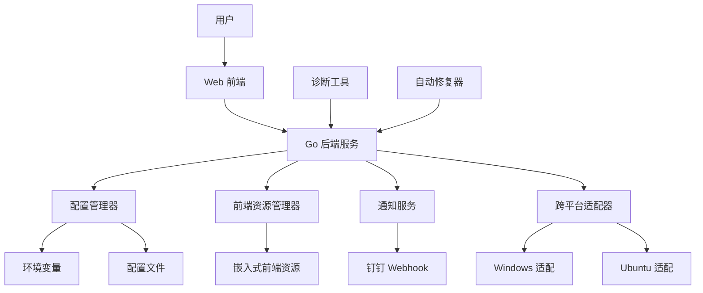

# 部署配置修复设计文档

## 概述

本设计文档描述了修复 qwq AIOps 平台部署配置问题的技术方案。主要解决前端无法交互、钉钉报警未配置以及跨平台兼容性问题，确保系统在 Windows 开发环境和 Ubuntu 生产环境中的一致性和可靠性。

## 架构

### 整体架构



### 核心组件

1. **前端资源管理器**: 负责前端资源的构建、嵌入和验证
2. **配置管理器**: 处理环境变量、配置文件的读取和验证
3. **通知服务**: 管理钉钉等通知渠道的配置和消息发送
4. **跨平台适配器**: 处理不同操作系统的兼容性问题
5. **诊断工具**: 提供自动化的问题诊断和修复建议
6. **自动修复器**: 执行自动化的修复操作

## 组件和接口

### 前端资源管理器

```go
type FrontendManager interface {
    // 验证前端资源完整性
    ValidateResources() error
    
    // 重新构建前端资源
    RebuildFrontend() error
    
    // 检查嵌入资源
    CheckEmbeddedResources() ([]string, error)
    
    // 获取资源统计信息
    GetResourceStats() ResourceStats
}

type ResourceStats struct {
    TotalFiles    int
    TotalSize     int64
    MissingFiles  []string
    CorruptedFiles []string
}
```

### 配置管理器

```go
type ConfigManager interface {
    // 验证配置完整性
    ValidateConfig() error
    
    // 创建默认配置
    CreateDefaultConfig() error
    
    // 获取配置状态
    GetConfigStatus() ConfigStatus
    
    // 修复配置问题
    FixConfigIssues() error
}

type ConfigStatus struct {
    EnvFileExists     bool
    RequiredVarsSet   map[string]bool
    DingTalkConfigured bool
    AIConfigured      bool
}
```

### 通知服务

```go
type NotificationService interface {
    // 验证通知配置
    ValidateNotificationConfig() error
    
    // 测试通知发送
    TestNotification(channel string) error
    
    // 发送告警消息
    SendAlert(title, content string) error
    
    // 发送状态报告
    SendStatusReport() error
}
```

### 跨平台适配器

```go
type PlatformAdapter interface {
    // 获取当前平台信息
    GetPlatformInfo() PlatformInfo
    
    // 执行平台特定命令
    ExecuteCommand(cmd string) (string, error)
    
    // 获取平台特定路径
    GetPlatformPath(path string) string
    
    // 验证平台兼容性
    ValidatePlatformCompatibility() error
}

type PlatformInfo struct {
    OS           string
    Architecture string
    IsContainer  bool
    DockerHost   string
}
```

## 数据模型

### 诊断结果

```go
type DiagnosticResult struct {
    Component    string                 `json:"component"`
    Status       DiagnosticStatus       `json:"status"`
    Issues       []Issue               `json:"issues"`
    Suggestions  []string              `json:"suggestions"`
    Timestamp    time.Time             `json:"timestamp"`
}

type DiagnosticStatus string

const (
    StatusHealthy DiagnosticStatus = "healthy"
    StatusWarning DiagnosticStatus = "warning"
    StatusError   DiagnosticStatus = "error"
)

type Issue struct {
    Type        IssueType `json:"type"`
    Description string    `json:"description"`
    Severity    Severity  `json:"severity"`
    FixCommand  string    `json:"fix_command,omitempty"`
}
```

### 修复操作

```go
type RepairOperation struct {
    ID          string            `json:"id"`
    Type        RepairType        `json:"type"`
    Description string            `json:"description"`
    Commands    []string          `json:"commands"`
    Status      RepairStatus      `json:"status"`
    Result      string            `json:"result,omitempty"`
    Error       string            `json:"error,omitempty"`
    Timestamp   time.Time         `json:"timestamp"`
}

type RepairType string

const (
    RepairFrontend     RepairType = "frontend"
    RepairConfig       RepairType = "config"
    RepairNotification RepairType = "notification"
    RepairPlatform     RepairType = "platform"
)
```

## 正确性属性

*属性是一个特征或行为，应该在系统的所有有效执行中保持为真——本质上是关于系统应该做什么的正式声明。属性作为人类可读规范和机器可验证正确性保证之间的桥梁。*

### 前端资源管理属性

**属性 1: 前端资源完整性验证**
*对于任何* 前端资源集合，验证操作应该能够检测出所有缺失或损坏的文件
**验证: 需求 1.1, 1.3**

**属性 2: 前端资源嵌入一致性**
*对于任何* 构建操作，嵌入到二进制文件中的资源应该与源文件完全一致
**验证: 需求 1.2**

**属性 3: API 响应正确性**
*对于任何* 有效的 API 请求，系统应该返回符合预期格式的响应数据
**验证: 需求 1.4**

**属性 4: 错误处理完整性**
*对于任何* 前端资源错误情况，系统应该提供清晰的错误信息和修复指导
**验证: 需求 1.5**

### 通知服务属性

**属性 5: 告警消息发送可靠性**
*对于任何* 检测到的异常情况，如果配置了有效的通知渠道，系统应该成功发送格式化的告警消息
**验证: 需求 2.1**

**属性 6: 配置验证准确性**
*对于任何* 钉钉 Webhook URL 配置，系统应该能够准确验证其有效性
**验证: 需求 2.2**

**属性 7: 定时报告一致性**
*对于任何* 配置的巡检周期，系统应该按时发送状态报告
**验证: 需求 2.3**

**属性 8: 错误记录完整性**
*对于任何* 通知发送失败的情况，系统应该记录详细的错误信息
**验证: 需求 2.4**

### 跨平台兼容性属性

**属性 9: 跨平台功能一致性**
*对于任何* 核心功能，在 Windows 和 Ubuntu 环境中应该表现一致
**验证: 需求 3.1**

**属性 10: Docker 部署兼容性**
*对于任何* Docker Compose 配置，应该在不同宿主机操作系统上正确运行
**验证: 需求 3.2**

**属性 11: 命令执行适配性**
*对于任何* Shell 命令，系统应该根据运行环境选择正确的语法和参数
**验证: 需求 3.3**

**属性 12: 构建产物一致性**
*对于任何* 跨平台构建操作，生成的二进制文件和前端资源应该功能一致
**验证: 需求 3.4**

### 配置管理属性

**属性 13: 配置验证完整性**
*对于任何* 系统启动，应该验证所有必要的配置项并提供缺失配置的指导
**验证: 需求 4.1**

**属性 14: 自动配置生成正确性**
*对于任何* 配置文件缺失的情况，系统应该自动创建有效的示例配置
**验证: 需求 4.2**

**属性 15: 服务连通性检查准确性**
*对于任何* 配置的服务，连通性检查应该准确反映服务的实际状态
**验证: 需求 4.3**

**属性 16: 问题诊断有效性**
*对于任何* 检测到的配置问题，系统应该提供有效的修复步骤
**验证: 需求 4.4**

### 自动化修复属性

**属性 17: 部署验证全面性**
*对于任何* 部署验证操作，应该检查所有关键组件的状态
**验证: 需求 5.1**

**属性 18: 自动修复有效性**
*对于任何* 检测到的前端资源问题，自动修复应该能够恢复正常功能
**验证: 需求 5.2**

**属性 19: 配置生成完整性**
*对于任何* 配置缺失情况，自动生成的配置应该包含所有必要的项目
**验证: 需求 5.3**

**属性 20: 错误分析准确性**
*对于任何* 服务启动失败，错误分析应该提供准确的原因和修复建议
**验证: 需求 5.4**

**属性 21: 修复过程可追溯性**
*对于任何* 修复操作，应该完整记录修复过程并验证修复结果
**验证: 需求 5.5**

## 错误处理

### 错误分类

1. **前端资源错误**
   - 资源文件缺失
   - 资源文件损坏
   - 嵌入过程失败

2. **配置错误**
   - 环境变量缺失
   - 配置文件格式错误
   - 服务连接失败

3. **通知错误**
   - Webhook URL 无效
   - 网络连接失败
   - 消息格式错误

4. **平台兼容性错误**
   - 命令语法不兼容
   - 路径格式错误
   - 权限问题

### 错误恢复策略

1. **自动重试**: 对于临时性错误，实施指数退避重试
2. **降级处理**: 在部分功能不可用时，确保核心功能正常
3. **用户引导**: 提供详细的错误信息和修复步骤
4. **日志记录**: 记录所有错误信息用于后续分析

## 测试策略

### 单元测试

- 测试各个组件的核心功能
- 验证错误处理逻辑
- 测试配置解析和验证
- 验证跨平台适配逻辑

### 属性基础测试

使用 Go 的 `testing/quick` 包进行属性基础测试：

- 每个属性测试运行至少 100 次迭代
- 生成随机输入数据验证属性
- 测试边界条件和异常情况
- 验证系统在各种输入下的正确性

### 集成测试

- 测试前后端完整交互流程
- 验证通知服务端到端功能
- 测试 Docker 环境部署
- 验证跨平台兼容性

### 端到端测试

- 模拟完整的部署和配置流程
- 测试自动化诊断和修复功能
- 验证用户操作的完整流程
- 测试异常情况的处理

测试将使用 Go 内置的 `testing/quick` 包进行属性基础测试，每个测试至少运行 100 次迭代以确保可靠性。